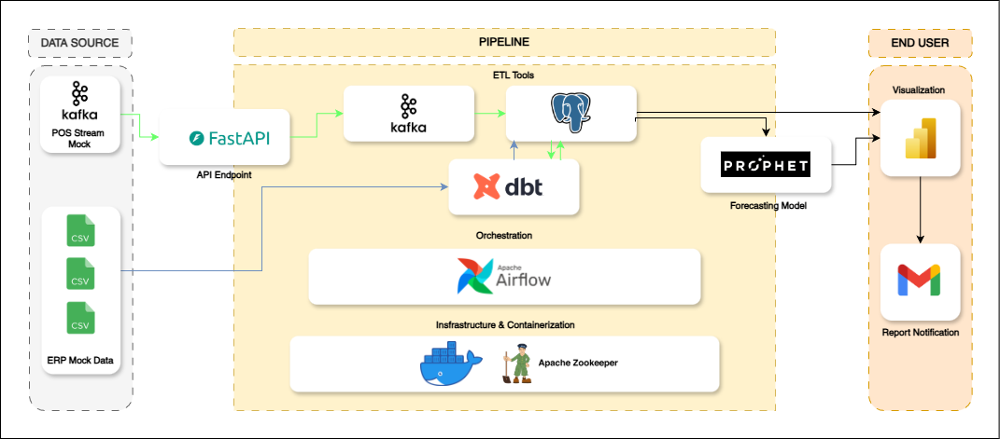

<div align="left">
    
    <div style="display: inline-block;">
        <h1 style="display: inline-block; vertical-align: middle; margin-top: 0;">REALTIME POS SYSTEM STREAMING AND DATA FORECASTING PIPELINE</h1>
        <p>
</p>
        <p>
	<!-- Shields.io badges disabled, using skill icons. --></p>
        <p>Built with the tools and technologies:</p>
        <p>
        
        
        
        
        
        
        
        
	</p>
    </div>
</div>
<br clear="left"/>

<details><summary>Table of Contents</summary>

- [ Overview](#-overview)
- [ Features](#-features)
- [ Project Structure](#-project-structure)
  - [ Project Index](#-project-index)
- [ Getting Started](#-getting-started)
  - [ Prerequisites](#-prerequisites)
  - [ Installation](#-installation)
  - [ Usage](#-usage)
  - [ Testing](#-testing)
- [ Project Roadmap](#-project-roadmap)
<!-- - [ Contributing](#-contributing)
- [ License](#-license)
- [ Acknowledgments](#-acknowledgments) -->

</details>
<hr>

##  Project Overview
This project simulates the complete data flow inside a typical Fast-Moving Consumer Goods (FMCG) company. It is designed to represent how real-world FMCG businesses manage retail demand forecasting, inventory tracking, supply-chain decisions, and operational reporting through data pipelines.

The repository demonstrates a full data engineering + analytics + modeling environment, starting from raw data ingestion all the way to ETL transformation, data warehousing, forecasting models, containerized infrastructure, and business analytics.

The goal is to provide a realistic system that mimics how FMCG companies operate daily using data-driven decisions. 

###  Background
FMCG companies deal with high-volume, fast-moving products that require accurate forecasting, tight inventory control, and robust operational pipelines. Even small fluctuations in consumer demand can cause costly outcomes:

- Stockouts → lost sales and customer dissatisfaction
- Overstocking → capital loss & product expiry
- Inefficient replenishment → logistic inefficiencies

This project captures those real challenges and builds a simulated ecosystem that mirrors real FMCG data workflows.
It includes:

- Raw data ingestion (sales, stores, items, supply-chain data)
- Batch and/or streaming transformations
- Data modeling & business logic
- Warehouse-ready tables and marts
- Forecasting and analytics layers
- Infrastructure setup using Docker and service orchestration

---

##  Project Goal
1. Build a complete end-to-end data pipeline that simulates real FMCG operations.
2. Forecast retail product demand using predictive modeling.
3. Transform raw data into analytics-ready models through a structured ETL/ELT workflow.
4. Provide actionable business insights through dashboards and analytical reporting.
5. Deploy a fully containerized, production-like data environment for realistic FMCG simulations.

---

##  Project Structure
<details open>
	<summary><b><code>DE-FMGC/</code></b></summary>
	<details> <!-- __root__ Submodule -->
		<summary><b>__root__</b></summary>
		<blockquote>
			<table>
			<tr>
				<td><b><a href='https://github.com/neinAlkem/de-fmgc/blob/master/docker-compose.yaml'>docker-compose.yaml</a></b></td>
				<td><code>❯ REPLACE-ME</code></td>
			</tr>
			<tr>
				<td><b><a href='https://github.com/neinAlkem/de-fmgc/blob/master/dockerfile'>dockerfile</a></b></td>
				<td><code>❯ REPLACE-ME</code></td>
			</tr>
			<tr>
				<td><b><a href='https://github.com/neinAlkem/de-fmgc/blob/master/requirements.txt'>requirements.txt</a></b></td>
				<td><code>❯ REPLACE-ME</code></td>
			</tr>
			<tr>
				<td><b><a href='https://github.com/neinAlkem/de-fmgc/blob/master/dbSetup.py'>dbSetup.py</a></b></td>
				<td><code>❯ REPLACE-ME</code></td>
			</tr>
			</table>
		</blockquote>
	</details>
	<details> <!-- etl Submodule -->
		<summary><b>etl</b></summary>
		<blockquote>
			<details>
				<summary><b>dags</b></summary>
				<blockquote>
					<details>
						<summary><b>weekly</b></summary>
						<blockquote>
							<table>
							<tr>
								<td><b><a href='https://github.com/neinAlkem/de-fmgc/blob/master/etl/dags/weekly/weekly_salesForecast.py'>weekly_salesForecast.py</a></b></td>
								<td><code>❯ REPLACE-ME</code></td>
							</tr>
							</table>
						</blockquote>
					</details>
					<details>
						<summary><b>yearly</b></summary>
						<blockquote>
							<table>
							<tr>
								<td><b><a href='https://github.com/neinAlkem/de-fmgc/blob/master/etl/dags/yearly/placeholder.txt'>placeholder.txt</a></b></td>
								<td><code>❯ REPLACE-ME</code></td>
							</tr>
							</table>
						</blockquote>
					</details>
					<details>
						<summary><b>daily</b></summary>
						<blockquote>
							<table>
							<tr>
								<td><b><a href='https://github.com/neinAlkem/de-fmgc/blob/master/etl/dags/daily/daily_salesAggregation.py'>daily_salesAggregation.py</a></b></td>
								<td><code>❯ REPLACE-ME</code></td>
							</tr>
							</table>
						</blockquote>
					</details>
					<details>
						<summary><b>monthly</b></summary>
						<blockquote>
							<table>
							<tr>
								<td><b><a href='https://github.com/neinAlkem/de-fmgc/blob/master/etl/dags/monthly/placehorder.txt'>placehorder.txt</a></b></td>
								<td><code>❯ REPLACE-ME</code></td>
							</tr>
							</table>
						</blockquote>
					</details>
				</blockquote>
			</details>
		</blockquote>
	</details>
	<details> <!-- dbt_project Submodule -->
		<summary><b>dbt_project</b></summary>
		<blockquote>
			<table>
			<tr>
				<td><b><a href='https://github.com/neinAlkem/de-fmgc/blob/master/dbt_project/.user.yml'>.user.yml</a></b></td>
				<td><code>❯ REPLACE-ME</code></td>
			</tr>
			<tr>
				<td><b><a href='https://github.com/neinAlkem/de-fmgc/blob/master/dbt_project/dbt_project.yml'>dbt_project.yml</a></b></td>
				<td><code>❯ REPLACE-ME</code></td>
			</tr>
			<tr>
				<td><b><a href='https://github.com/neinAlkem/de-fmgc/blob/master/dbt_project/package-lock.yml'>package-lock.yml</a></b></td>
				<td><code>❯ REPLACE-ME</code></td>
			</tr>
			<tr>
				<td><b><a href='https://github.com/neinAlkem/de-fmgc/blob/master/dbt_project/profiles.yml'>profiles.yml</a></b></td>
				<td><code>❯ REPLACE-ME</code></td>
			</tr>
			<tr>
				<td><b><a href='https://github.com/neinAlkem/de-fmgc/blob/master/dbt_project/packages.yml'>packages.yml</a></b></td>
				<td><code>❯ REPLACE-ME</code></td>
			</tr>
			</table>
			<details>
				<summary><b>macros</b></summary>
				<blockquote>
					<table>
					<tr>
						<td><b><a href='https://github.com/neinAlkem/de-fmgc/blob/master/dbt_project/macros/aggregation.sql'>aggregation.sql</a></b></td>
						<td><code>❯ REPLACE-ME</code></td>
					</tr>
					</table>
					<details>
						<summary><b>custom_tests</b></summary>
						<blockquote>
							<table>
							<tr>
								<td><b><a href='https://github.com/neinAlkem/de-fmgc/blob/master/dbt_project/macros/custom_tests/test_not_negative.sql'>test_not_negative.sql</a></b></td>
								<td><code>❯ REPLACE-ME</code></td>
							</tr>
							<tr>
								<td><b><a href='https://github.com/neinAlkem/de-fmgc/blob/master/dbt_project/macros/custom_tests/test_date_not_tommorow.sql'>test_date_not_tommorow.sql</a></b></td>
								<td><code>❯ REPLACE-ME</code></td>
							</tr>
							</table>
						</blockquote>
					</details>
				</blockquote>
			</details>
			<details>
				<summary><b>models</b></summary>
				<blockquote>
					<table>
					<tr>
						<td><b><a href='https://github.com/neinAlkem/de-fmgc/blob/master/dbt_project/models/schema.yml'>schema.yml</a></b></td>
						<td><code>❯ REPLACE-ME</code></td>
					</tr>
					<tr>
						<td><b><a href='https://github.com/neinAlkem/de-fmgc/blob/master/dbt_project/models/sources.yml'>sources.yml</a></b></td>
						<td><code>❯ REPLACE-ME</code></td>
					</tr>
					</table>
					<details>
						<summary><b>stg</b></summary>
						<blockquote>
							<table>
							<tr>
								<td><b><a href='https://github.com/neinAlkem/de-fmgc/blob/master/dbt_project/models/stg/stg_pos.sql'>stg_pos.sql</a></b></td>
								<td><code>❯ REPLACE-ME</code></td>
							</tr>
							<tr>
								<td><b><a href='https://github.com/neinAlkem/de-fmgc/blob/master/dbt_project/models/stg/stg_area.sql'>stg_area.sql</a></b></td>
								<td><code>❯ REPLACE-ME</code></td>
							</tr>
							<tr>
								<td><b><a href='https://github.com/neinAlkem/de-fmgc/blob/master/dbt_project/models/stg/stg_stores.sql'>stg_stores.sql</a></b></td>
								<td><code>❯ REPLACE-ME</code></td>
							</tr>
							<tr>
								<td><b><a href='https://github.com/neinAlkem/de-fmgc/blob/master/dbt_project/models/stg/stg_products.sql'>stg_products.sql</a></b></td>
								<td><code>❯ REPLACE-ME</code></td>
							</tr>
							</table>
						</blockquote>
					</details>
					<details>
						<summary><b>marts</b></summary>
						<blockquote>
							<details>
								<summary><b>sales</b></summary>
								<blockquote>
									<table>
									<tr>
										<td><b><a href='https://github.com/neinAlkem/de-fmgc/blob/master/dbt_project/models/marts/sales/marts_daily_sales.sql'>marts_daily_sales.sql</a></b></td>
										<td><code>❯ REPLACE-ME</code></td>
									</tr>
									<tr>
										<td><b><a href='https://github.com/neinAlkem/de-fmgc/blob/master/dbt_project/models/marts/sales/marts_products_daily_sales.sql'>marts_products_daily_sales.sql</a></b></td>
										<td><code>❯ REPLACE-ME</code></td>
									</tr>
									</table>
								</blockquote>
							</details>
							<details>
								<summary><b>core</b></summary>
								<blockquote>
									<table>
									<tr>
										<td><b><a href='https://github.com/neinAlkem/de-fmgc/blob/master/dbt_project/models/marts/core/marts_date.sql'>marts_date.sql</a></b></td>
										<td><code>❯ REPLACE-ME</code></td>
									</tr>
									</table>
								</blockquote>
							</details>
						</blockquote>
					</details>
					<details>
						<summary><b>dbo</b></summary>
						<blockquote>
							<table>
							<tr>
								<td><b><a href='https://github.com/neinAlkem/de-fmgc/blob/master/dbt_project/models/dbo/dbo_pos.sql'>dbo_pos.sql</a></b></td>
								<td><code>❯ REPLACE-ME</code></td>
							</tr>
							<tr>
								<td><b><a href='https://github.com/neinAlkem/de-fmgc/blob/master/dbt_project/models/dbo/dbo_products.sql'>dbo_products.sql</a></b></td>
								<td><code>❯ REPLACE-ME</code></td>
							</tr>
							<tr>
								<td><b><a href='https://github.com/neinAlkem/de-fmgc/blob/master/dbt_project/models/dbo/dbo_stores.sql'>dbo_stores.sql</a></b></td>
								<td><code>❯ REPLACE-ME</code></td>
							</tr>
							<tr>
								<td><b><a href='https://github.com/neinAlkem/de-fmgc/blob/master/dbt_project/models/dbo/dbo_area.sql'>dbo_area.sql</a></b></td>
								<td><code>❯ REPLACE-ME</code></td>
							</tr>
							</table>
						</blockquote>
					</details>
				</blockquote>
			</details>
		</blockquote>
	</details>
	<details> <!-- models Submodule -->
		<summary><b>models</b></summary>
		<blockquote>
			<details>
				<summary><b>model</b></summary>
				<blockquote>
					<table>
					<tr>
						<td><b><a href='https://github.com/neinAlkem/de-fmgc/blob/master/models/model/model_10.joblib'>model_10.joblib</a></b></td>
						<td><code>❯ REPLACE-ME</code></td>
					</tr>
					<tr>
						<td><b><a href='https://github.com/neinAlkem/de-fmgc/blob/master/models/model/model_1.joblib'>model_1.joblib</a></b></td>
						<td><code>❯ REPLACE-ME</code></td>
					</tr>
					<tr>
						<td><b><a href='https://github.com/neinAlkem/de-fmgc/blob/master/models/model/model_12.joblib'>model_12.joblib</a></b></td>
						<td><code>❯ REPLACE-ME</code></td>
					</tr>
					<tr>
						<td><b><a href='https://github.com/neinAlkem/de-fmgc/blob/master/models/model/model_5.joblib'>model_5.joblib</a></b></td>
						<td><code>❯ REPLACE-ME</code></td>
					</tr>
					<tr>
						<td><b><a href='https://github.com/neinAlkem/de-fmgc/blob/master/models/model/model_3.joblib'>model_3.joblib</a></b></td>
						<td><code>❯ REPLACE-ME</code></td>
					</tr>
					<tr>
						<td><b><a href='https://github.com/neinAlkem/de-fmgc/blob/master/models/model/model_9.joblib'>model_9.joblib</a></b></td>
						<td><code>❯ REPLACE-ME</code></td>
					</tr>
					<tr>
						<td><b><a href='https://github.com/neinAlkem/de-fmgc/blob/master/models/model/model_2.joblib'>model_2.joblib</a></b></td>
						<td><code>❯ REPLACE-ME</code></td>
					</tr>
					<tr>
						<td><b><a href='https://github.com/neinAlkem/de-fmgc/blob/master/models/model/model_11.joblib'>model_11.joblib</a></b></td>
						<td><code>❯ REPLACE-ME</code></td>
					</tr>
					<tr>
						<td><b><a href='https://github.com/neinAlkem/de-fmgc/blob/master/models/model/model_4.joblib'>model_4.joblib</a></b></td>
						<td><code>❯ REPLACE-ME</code></td>
					</tr>
					<tr>
						<td><b><a href='https://github.com/neinAlkem/de-fmgc/blob/master/models/model/model_6.joblib'>model_6.joblib</a></b></td>
						<td><code>❯ REPLACE-ME</code></td>
					</tr>
					<tr>
						<td><b><a href='https://github.com/neinAlkem/de-fmgc/blob/master/models/model/model_7.joblib'>model_7.joblib</a></b></td>
						<td><code>❯ REPLACE-ME</code></td>
					</tr>
					<tr>
						<td><b><a href='https://github.com/neinAlkem/de-fmgc/blob/master/models/model/model_8.joblib'>model_8.joblib</a></b></td>
						<td><code>❯ REPLACE-ME</code></td>
					</tr>
					</table>
				</blockquote>
			</details>
			<details>
				<summary><b>src</b></summary>
				<blockquote>
					<table>
					<tr>
						<td><b><a href='https://github.com/neinAlkem/de-fmgc/blob/master/models/src/predict.py'>predict.py</a></b></td>
						<td><code>❯ REPLACE-ME</code></td>
					</tr>
					<tr>
						<td><b><a href='https://github.com/neinAlkem/de-fmgc/blob/master/models/src/train.py'>train.py</a></b></td>
						<td><code>❯ REPLACE-ME</code></td>
					</tr>
					<tr>
						<td><b><a href='https://github.com/neinAlkem/de-fmgc/blob/master/models/src/extractData.py'>extractData.py</a></b></td>
						<td><code>❯ REPLACE-ME</code></td>
					</tr>
					</table>
				</blockquote>
			</details>
		</blockquote>
	</details>
	<details> <!-- stream Submodule -->
		<summary><b>stream</b></summary>
		<blockquote>
			<table>
			<tr>
				<td><b><a href='https://github.com/neinAlkem/de-fmgc/blob/master/stream/consumerDB.py'>consumerDB.py</a></b></td>
				<td><code>❯ REPLACE-ME</code></td>
			</tr>
			<tr>
				<td><b><a href='https://github.com/neinAlkem/de-fmgc/blob/master/stream/mockData.py'>mockData.py</a></b></td>
				<td><code>❯ REPLACE-ME</code></td>
			</tr>
			<tr>
				<td><b><a href='https://github.com/neinAlkem/de-fmgc/blob/master/stream/consumer.py'>consumer.py</a></b></td>
				<td><code>❯ REPLACE-ME</code></td>
			</tr>
			</table>
		</blockquote>
	</details>
</details>

---
##  Data Flow
---
##  Query Analysis
---
##  Visualization Report
---
##  Getting Started

###  Prerequisites

Before getting started with de-fmgc, ensure your runtime environment meets the following requirements:

- **Programming Language:** SQL, Python
- **Package Manager:** Pip or UV
- **Container Runtime:** Docker


###  Installation

Install de-fmgc using one of the following methods:

**Build from source:**

1. Clone the de-fmgc repository:
```sh
❯ git clone https://github.com/neinAlkem/de-fmgc
```

2. Navigate to the project directory:
```sh
❯ cd de-fmgc
```
---
##  Project Roadmap

- [X] **`Task 1`**: <strike>Build end to end data pipeline.</strike>
- [X] **`Task 2`**: <strike>Implement forecasting model with Prophet model.</strike>
- [X] **`Task 3`**: <strike>Implement apache airflow for orchestration.</strike>
- [ ] **`Task 4`**: Create power BI Dashboard for visualization and auto report.


<!-- ---

##  Contributing

- **💬 [Join the Discussions](https://github.com/neinAlkem/de-fmgc/discussions)**: Share your insights, provide feedback, or ask questions.
- **🐛 [Report Issues](https://github.com/neinAlkem/de-fmgc/issues)**: Submit bugs found or log feature requests for the `de-fmgc` project.
- **💡 [Submit Pull Requests](https://github.com/neinAlkem/de-fmgc/blob/main/CONTRIBUTING.md)**: Review open PRs, and submit your own PRs.

<details closed>
<summary>Contributing Guidelines</summary>

1. **Fork the Repository**: Start by forking the project repository to your github account.
2. **Clone Locally**: Clone the forked repository to your local machine using a git client.
   ```sh
   git clone https://github.com/neinAlkem/de-fmgc
   ```
3. **Create a New Branch**: Always work on a new branch, giving it a descriptive name.
   ```sh
   git checkout -b new-feature-x
   ```
4. **Make Your Changes**: Develop and test your changes locally.
5. **Commit Your Changes**: Commit with a clear message describing your updates.
   ```sh
   git commit -m 'Implemented new feature x.'
   ```
6. **Push to github**: Push the changes to your forked repository.
   ```sh
   git push origin new-feature-x
   ```
7. **Submit a Pull Request**: Create a PR against the original project repository. Clearly describe the changes and their motivations.
8. **Review**: Once your PR is reviewed and approved, it will be merged into the main branch. Congratulations on your contribution!
</details>

<details closed>
<summary>Contributor Graph</summary>
<br>
<p align="left">
   <a href="https://github.com{/neinAlkem/de-fmgc/}graphs/contributors">
      
   </a>
</p>
</details>

---

##  License

This project is protected under the [SELECT-A-LICENSE](https://choosealicense.com/licenses) License. For more details, refer to the [LICENSE](https://choosealicense.com/licenses/) file.

---

##  Acknowledgments

- List any resources, contributors, inspiration, etc. here.

--- -->
